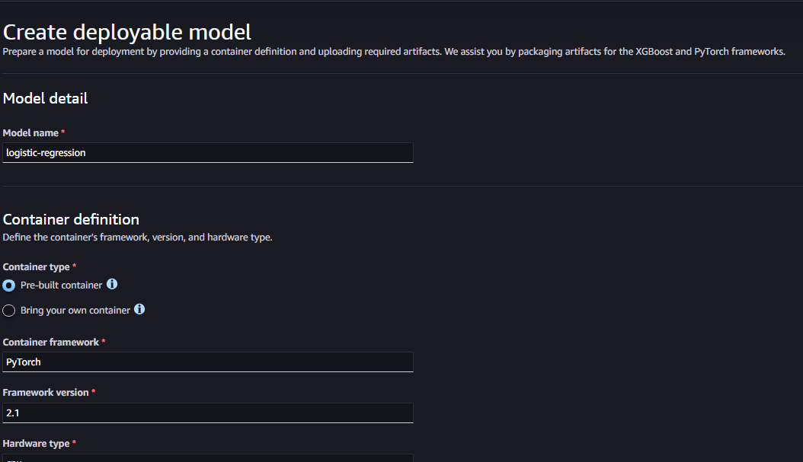
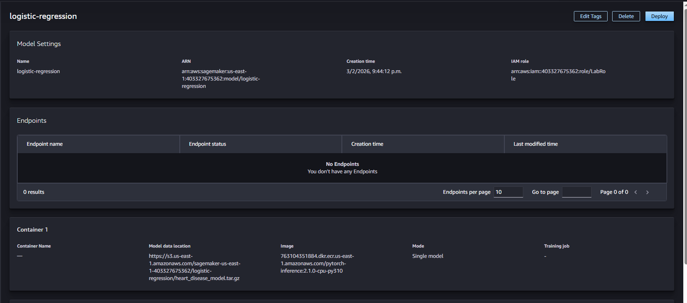
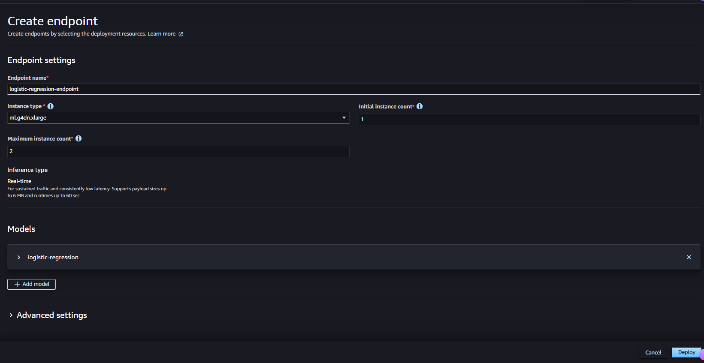
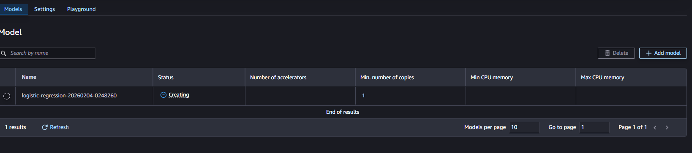
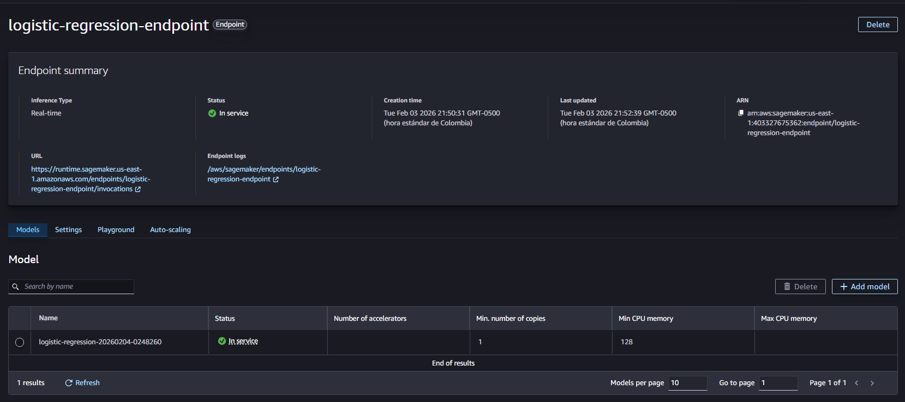
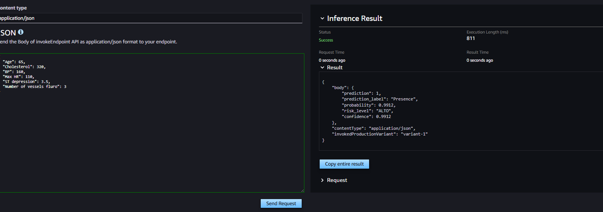

# Heart Disease Prediction using Logistic Regression

A comprehensive machine learning project that implements logistic regression from scratch to predict heart disease risk. This project explores classification techniques, feature selection, regularization, and model deployment strategies without relying on high-level ML libraries like scikit-learn for the core algorithm.

## Getting Started

These instructions will help you set up and run the heart disease prediction model on your local machine for development, testing, and deployment purposes.

### Prerequisites

Before running this project, ensure you have the following software installed:

```bash
Python 3.8 or higher
Jupyter Notebook or JupyterLab
```

Required Python packages:

```bash
numpy>=1.21.0
pandas>=1.3.0
matplotlib>=3.4.0
```

### Installing

Follow these steps to set up your development environment:

1. Clone the repository

```bash
git clone https://github.com/SantiagoHM20/classification-and-logistic-regression.git
cd classification-and-logistic-regression
```

2. Install required packages

```bash
pip install numpy pandas matplotlib
```

3. Launch Jupyter Notebook

```bash
jupyter notebook heart_disease_lr_analysis.ipynb
```

4. Run all cells sequentially to train the model

The notebook will load the dataset (`Heart_Disease_Prediction.csv`), perform exploratory data analysis, train multiple models with different feature combinations, and export the best model.

### Example Usage

After training, you can make predictions using the exported model:

```python
# Load the model
import pickle
import tarfile

with tarfile.open("heart_disease_model_sagemaker.tar.gz", "r:gz") as tar:
    tar.extractall()

# Make a prediction
patient_data = {
    "Age": 60,
    "Cholesterol": 320,
    "BP": 160,
    "Max HR": 110,
    "ST depression": 3.5,
    "Number of vessels fluro": 3
}

# Use the predict_from_json function defined in the notebook
result = predict_from_json(patient_data)
print(result)
# Output: {'prediction': 1, 'probability': 0.67, 'risk_level': 'HIGH'}
```

## Running the Tests

The notebook includes comprehensive validation tests for the inference pipeline.

### Model Validation Tests

The validation suite tests the following scenarios:

1. **High-risk patient prediction** - Verifies correct classification of high-risk profiles
2. **Low-risk patient prediction** - Validates detection of low-risk profiles
3. **Missing features detection** - Ensures proper error handling for incomplete input
4. **Invalid feature names** - Tests validation of feature name spelling
5. **Array format support** - Confirms alternative input format works correctly
6. **Incomplete array detection** - Validates array length checking
7. **Format consistency** - Verifies both input formats produce identical results

Example test execution:

```python
# Test high-risk patient
high_risk_patient = {
    "Age": 70, "Cholesterol": 400, "BP": 180,
    "Max HR": 90, "ST depression": 4.5, "Number of vessels fluro": 3
}
result = predict_from_json(high_risk_patient)
assert result['risk_level'] == 'HIGH'
```

### Model Performance Metrics

The trained model achieves:
- **Test Accuracy**: 76.54%
- **Optimal Lambda**: 0 (unregularized model selected)
- **Features**: 6 clinical indicators (Age, Cholesterol, BP, Max HR, ST depression, Number of vessels fluro)

## Deployment

### Local Deployment

The model can be deployed locally by extracting the tar.gz file and using the included inference script:

```bash
# Extract model files
tar -xzf heart_disease_model_sagemaker.tar.gz

# Run inference locally (see notebook for complete code)
python inference.py
```

### Cloud Deployment (AWS SageMaker)

For production deployment on AWS SageMaker:

1. Upload the model artifact to S3

```python
import sagemaker

sagemaker_session = sagemaker.Session()
model_data = sagemaker_session.upload_data(
    path='heart_disease_model_sagemaker.tar.gz',
    bucket=sagemaker_session.default_bucket(),
    key_prefix='heart-disease-model'
)
```

2. Create and deploy the model

```python
from sagemaker.sklearn import SKLearnModel

model = SKLearnModel(
    model_data=model_data,
    role='<YOUR_SAGEMAKER_ROLE_ARN>',
    framework_version='1.0-1',
    py_version='py3'
)

predictor = model.deploy(
    instance_type='ml.t2.medium',
    initial_instance_count=1,
    endpoint_name='heart-disease-endpoint'
)
```

3. Make predictions via endpoint

```python
response = predictor.predict({
    "Age": 60, "Cholesterol": 320, "BP": 160,
    "Max HR": 110, "ST depression": 3.5, "Number of vessels fluro": 3
})
```

### Deployment Process Visualization

The following images show the step-by-step AWS SageMaker deployment process:

**1. Creating the Model**



**2. Model Created Successfully**



**3. Creating the Endpoint**



**4. Deploying Model to Endpoint**



**5. Model and Endpoint Deployed**



**6. Endpoint Running and Ready**



## Model Inference

### Why Custom Inference Implementation?

This project implements a custom inference pipeline rather than using scikit-learn's built-in logistic regression for several important reasons:

1. **Educational Purpose**: Building logistic regression from scratch demonstrates deep understanding of the algorithm, including gradient descent optimization, regularization, and the sigmoid function.

2. **Full Control**: Custom implementation allows fine-tuned control over:
   - Gradient descent parameters (learning rate, iterations)
   - Regularization strategies (L2 penalty with custom lambda values)
   - Feature normalization techniques
   - Cost function computation and monitoring

3. **Deployment Flexibility**: The NumPy-based implementation creates a lightweight model that:
   - Has minimal dependencies (only NumPy required)
   - Produces small model artifacts (< 3 KB)
   - Can be deployed to any platform supporting Python
   - Avoids version compatibility issues with ML frameworks

4. **Transparency**: Every step of the prediction process is explicit:
   - Feature normalization using training statistics
   - Linear combination computation (z = wx + b)
   - Sigmoid transformation for probability
   - Risk level classification based on probability thresholds

### Inference Pipeline

The model inference follows this workflow:

1. **Input Validation**: Check for correct feature names and count
2. **Normalization**: Apply z-score normalization using training statistics
3. **Linear Transformation**: Compute z = w·x + b
4. **Probability Calculation**: Apply sigmoid function σ(z) = 1/(1+e^(-z))
5. **Classification**: Threshold at 0.5 for binary prediction
6. **Risk Stratification**: Categorize as LOW (<0.3), MODERATE (0.3-0.7), or HIGH (>0.7)

This approach provides interpretable results and allows for easy modification of risk thresholds based on clinical requirements.

## Built With

* **NumPy** - Numerical computing library for array operations and mathematical functions
* **Pandas** - Data manipulation and analysis toolkit
* **Matplotlib** - Data visualization and plotting library
* **Jupyter** - Interactive development environment for data science

## Project Structure

```
classification-and-logistic-regression/
├── heart_disease_lr_analysis.ipynb    # Main analysis notebook
├── Heart_Disease_Prediction.csv       # Training dataset
├── heart_disease_model_sagemaker.tar.gz  # Deployable model artifact
├── inference.py                       # Inference script (generated)
├── requirements.txt                   # Model dependencies (generated)
├── README.md                          # This file
└── ClassificationAndLogisticRegressionFiles/
    ├── APENDIX-RidgeVsGradientDescentInRegularizedLinearRegression.ipynb
    ├── week2_classification_hour1_final.ipynb
    └── week2_classification_hour2_regularization_with_derivatives.ipynb
```

## Versioning

Version 1.0.0 - Initial release with complete implementation and deployment support.

## Authors

* **Santiago Hurtado Martínez** - [@SantiagoHM20](https://github.com/SantiagoHM20) - Complete implementation, analysis, and deployment pipeline

## License

This project is licensed under the MIT License - see the LICENSE file for details.

## Acknowledgments

* Dataset sourced from heart disease clinical studies
* Logistic regression implementation inspired by Andrew Ng's Machine Learning course
* Gradient descent optimization techniques from numerical methods literature
* AWS SageMaker deployment patterns from AWS documentation